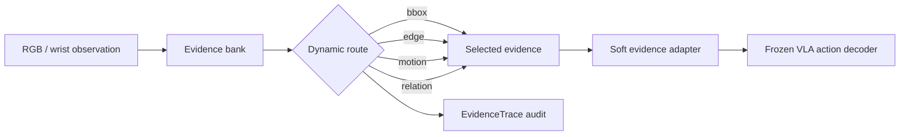

# EIGT: Efficient Image-Grounded Thinking for Vision-Language-Action Policies

[](https://www.python.org/)
[](https://pytorch.org/)
[](LICENSE)
[](#release-scope)

This repository contains the research code for **EIGT**, a lightweight evidence-routing layer for
Vision-Language-Action (VLA) policies. EIGT keeps the base VLA frozen and dynamically routes a sparse set of
image-grounded evidence channels into the policy, making inference more efficient while preserving an auditable
route-and-rationale trace.

The implementation is built on top of the public [OpenVLA](https://github.com/openvla/openvla) codebase and adds
the EIGT feature extraction, sparse routing, soft-evidence adapter, trace governance, and ablation scripts used by
the paper.

## What EIGT Adds

- **Sparse evidence routing:** select a small subset of visual evidence channels per control step.
- **Soft evidence interface:** inject selected evidence into a frozen OpenVLA-style policy without dense perception at every step.
- **Traceable decisions:** emit route masks, selected evidence, visual rationales, utility ranks, and audit metrics.
- **Paper workflows:** scripts for channel screening, feature ablations, recipe ablations, trace audits, and benchmark summaries.



## Repository Layout

```text
commands/project/     End-to-end shell recipes for extraction, training, benchmarking, and ablations
configs/              Gating and soft-evidence configuration files
models/               EIGT gating and soft-evidence adapter modules
scripts/              Feature extraction, training, benchmarking, trace, and summary scripts
prismatic/            OpenVLA/Prismatic base code
vla-scripts/          OpenVLA training and deployment entry points
docs/                 Practical setup and reproducibility notes
```

## Quick Start

```bash
git clone https://github.com/fengnian123/EIGT-Efficient-Image-Grounded-Thinking-for-Vision-Language-Action-Policies.git
cd EIGT-Efficient-Image-Grounded-Thinking-for-Vision-Language-Action-Policies

conda create -n eigt python=3.10 -y
conda activate eigt
pip install -e .
pip install -r requirements-min.txt
```

Set paths through environment variables rather than editing scripts:

```bash
export OPENVLA_ROOT="$PWD"
export DATASET=bridge
export RUN_NAME=bridge_eigt_demo
export VLA_PATH=openvla/openvla-7b
export BRIDGE_DATA_ROOT=/path/to/rlds/datasets
```

Run a minimal environment check:

```bash
bash commands/project/02_check_env.sh
```

## Core Workflow

The scripts are numbered in the order used by the project. Most commands write to
`runs/$RUN_NAME/`, which is intentionally ignored by git.

```bash
# 1. Extract a proportional RLDS subset and visual/evidence features.
bash commands/project/04_extract_subset.sh
bash commands/project/06_batch_features.sh

# 2. Train sparse routing and soft-evidence adapters.
bash commands/project/13_train_learned_gating.sh
bash commands/project/16_train_openvla_soft_full.sh
bash commands/project/17_train_openvla_soft_dynamic.sh

# 3. Compare BaseVLA, FullSoft, and EIGT.
bash commands/project/18_benchmark_openvla_soft_three_way.sh

# 4. Build and audit EvidenceTrace outputs.
bash commands/project/21_build_evidence_trace_dataset.sh
bash commands/project/22_benchmark_evidence_trace_faithfulness.sh
```

See [docs/PIPELINE.md](docs/PIPELINE.md) for the longer paper-oriented workflow, including ablations.

## Release Scope

This repository includes source code, configuration files, and run recipes only.

It intentionally does **not** include:

- robot/RLDS datasets,
- pretrained or fine-tuned model weights,
- generated traces, cached features, or benchmark outputs,
- paper result tables, local logs, or `wandb` runs.

Use the scripts to regenerate those artifacts locally after downloading the required datasets and base checkpoints.

## Main Entry Points

- `models/evidence_gating.py`: learned dynamic evidence router.
- `models/openvla_soft_evidence.py`: soft evidence adapter and action prediction wrapper.
- `scripts/build_evidence_trace_dataset.py`: converts routed evidence into auditable EvidenceTrace rows.
- `scripts/benchmark_evidencetrace_audit_methods.py`: builds the supervision/audit table used by the paper.
- `commands/project/46_launch_evidencetrace_audit_table_tmux.sh`: tmux launcher for the audit benchmark.

## Citation

If you use this code, please cite the EIGT paper once the final citation is available. This release also builds on
OpenVLA, so please cite the original OpenVLA work when using the base policy code.

```bibtex
@misc{eigt2026,
  title  = {EIGT: Efficient Image-Grounded Thinking for Vision-Language-Action Policies},
  author = {Anonymous},
  year   = {2026},
  note   = {Research code release}
}
```

## Acknowledgements

This repository reuses and extends the OpenVLA/Prismatic codebase. The EIGT-specific additions are the evidence
routing, soft-evidence adapter, trace governance, and paper ablation workflows.
