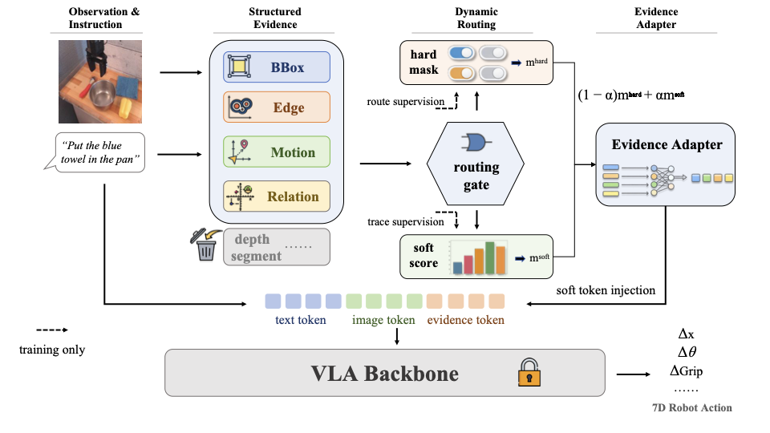
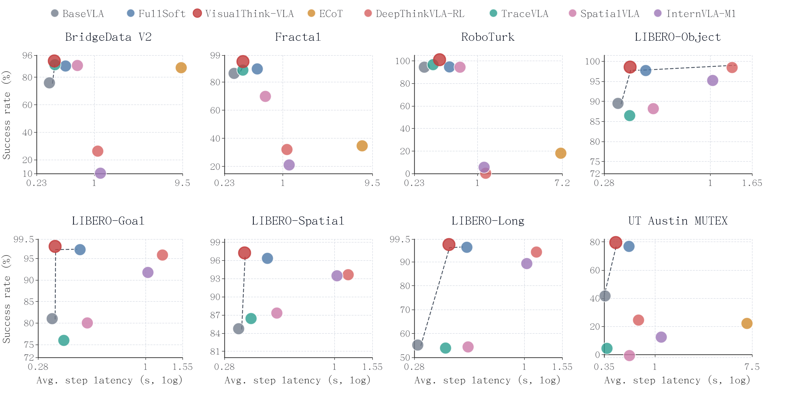
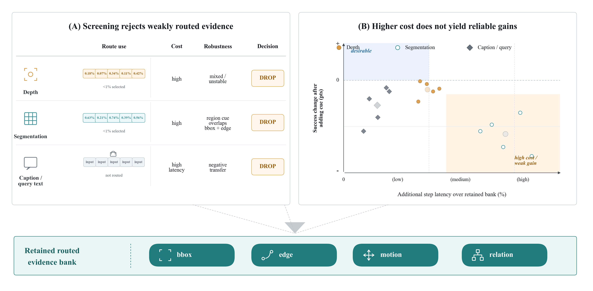
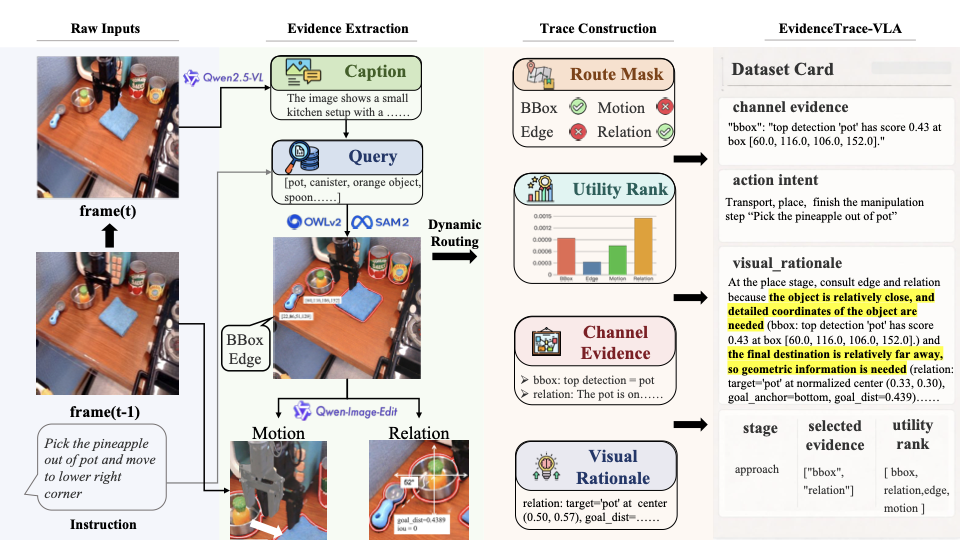
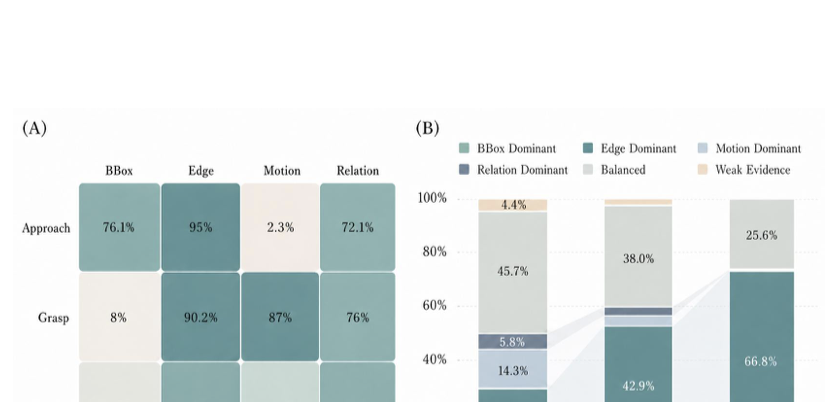

# EIGT

### Efficient Image-Grounded Thinking for Vision-Language-Action Policies

<p align="center">
  <a href="https://www.python.org/"></a>
  <a href="https://pytorch.org/"></a>
  <a href="LICENSE"></a>
  
</p>

<p align="center">
  <b>EIGT</b> is a sparse soft-evidence routing recipe for vision-language-action policies.
  It lets a frozen VLA policy <b>think with images</b> by consulting compact visual cues before action decoding,
  instead of relying only on raw pixels, long textual chain-of-thought, or always-on dense perception.
</p>

<p align="center">
  
</p>

## Paper Status

This repository tracks the current EMNLP 2026 paper version. The latest manuscript evaluates EIGT through four
complementary tracks:

| Track | Role in the Paper |
| --- | --- |
| Multi-dataset control benchmark | Main success-latency comparison across real-world, simulation, and long-horizon tasks |
| EvidenceTrace-VLA supervision and audit | Checks routed evidence, written rationales, and counterfactual utility alignment |
| Real-robot closed-loop study | Deployment-time evaluation track for policy cadence and task completion |
| Supplementary transfer and ablation analyses | Channel screening, routing recipe ablations, task slices, and expanded diagnostics |

The current implementation uses OpenVLA as the concrete token-based VLA backbone, but the evidence bank, router,
EvidenceTrace construction, and quality-governance layer are defined at the VLA-interface level.

## Main Benchmark Snapshot

The main table compares recent VLA-thinking methods by their reasoning interface: textual CoT, reinforced or
hybrid thinking-action decoding, spatial/image-grounded thinking, and the matched OpenVLA-family re-evaluation
used for EIGT.

| Benchmark | EIGT Success (%) | Avg. Step Latency (s) |
| --- | ---: | ---: |
| BridgeData V2 | **89.49** | 0.367 |
| Fractal | **90.82** | 0.367 |
| RoboTurk | 96.10 | 0.415 |
| LIBERO-Object | 97.74 | 0.385 |
| LIBERO-Goal | 97.05 | 0.345 |
| LIBERO-Spatial | **96.69** | 0.356 |
| LIBERO-Long | 95.87 | 0.421 |
| UT Austin MUTEX | **77.26** | 0.451 |

<p align="center">
  
</p>

The core empirical claim is that sparse image-grounded evidence routing can stay competitive with recent
VLA-thinking pipelines while avoiding the full runtime cost of long text traces or dense multimodal reasoning.

## Why Sparse Image-Grounded Thinking?

Real robot observations often contain compact structure that is easy to extract but hard for a generic VLA to use
reliably from raw pixels alone: coarse object localization, geometric edges, short-horizon motion, and
instruction-grounded spatial relations. EIGT exposes these cues through learned soft evidence states and then
selects only the channels needed for the current control step.

| Design Goal | EIGT Choice |
| --- | --- |
| Keep control efficient | Route a sparse subset of evidence channels per step. |
| Stay visually grounded | Use structured visual cues rather than verbose prompt text. |
| Preserve the base policy | Freeze the VLA backbone and train lightweight evidence modules. |
| Make behavior inspectable | Export route masks, utility ranks, and channel-grounded traces. |

## Evidence Channel Screening

<p align="center">
  
</p>

The final routed evidence bank is intentionally compact:

```text
bbox, edge, motion, relation
```

The paper screens out monocular depth, segmentation, and caption/query-style text because they are expensive,
unstable, redundant with cheaper cues, not naturally routeable, or weakly selected by the sparse router. The
screening result supports the interface design choice: a compact routed evidence bank is preferable to simply
adding every available visual or textual cue.

## EvidenceTrace-VLA

EIGT includes an audit and supervision layer called **EvidenceTrace-VLA**. Each trace stores the instruction,
route mask, selected evidence names, counterfactual utility ranking, compact channel snippets, a channel-grounded
visual rationale, and an action-intent summary.

<p align="center">
  
</p>

The current governed EvidenceTrace-VLA export contains:

| Subset | Rows |
| --- | ---: |
| Raw governed rows | 942,836 |
| Full-Clean | 923,663 |
| HQ-Trace | 877,783 |
| Gold-Faithfulness | 754,690 |

These subsets serve different roles: Full-Clean supports broad statistics and weighted training, HQ-Trace supports
trace-supervised refinement, and Gold-Faithfulness is reserved for high-confidence audit experiments.

## Route and Faithfulness Diagnostics

<p align="center">
  
</p>

EvidenceTrace-VLA is not treated as another control benchmark. It tests whether routed evidence, rationale text,
and counterfactual interventions remain aligned. In the current paper, EIGT obtains the strongest trace score
and utility-mention score while preserving a sparse channel budget:

| Method | Trace Score | Routed Evidence | Utility-Mention | Avg. Selected Channels |
| --- | ---: | :---: | ---: | ---: |
| Prompt-text evidence | 0.3905 | No | 0.7684 | 4.00 |
| Heavy dense perception | 0.4405 | Yes | 0.7552 | 2.22 |
| FullSoft | 0.7905 | Yes | 0.9607 | 4.00 |
| EIGT | **0.8395** | Yes | **0.9835** | 2.22 |

The routing analysis aggregates governed traces across all EvidenceTrace-VLA sources and shows that selected
channels change across manipulation stages such as approach, grasp, and place.

## Repository Layout

```text
commands/project/     End-to-end shell recipes for extraction, training, benchmarking, and ablations
configs/              Gating and soft-evidence configuration files
models/               EIGT gating and soft-evidence adapter modules
scripts/              Feature extraction, training, benchmarking, trace, and summary scripts
prismatic/            OpenVLA/Prismatic base code
vla-scripts/          OpenVLA training and deployment entry points
docs/                 Practical setup and reproducibility notes
assets/               Paper figures used by this project page
```

## Quick Start

```bash
git clone https://github.com/fengnian123/EIGT-Efficient-Image-Grounded-Thinking-for-Vision-Language-Action-Policies.git
cd EIGT-Efficient-Image-Grounded-Thinking-for-Vision-Language-Action-Policies

conda create -n eigt python=3.10 -y
conda activate eigt
pip install -e .
pip install -r requirements-min.txt
```

Set paths through environment variables rather than editing scripts:

```bash
export OPENVLA_ROOT="$PWD"
export DATASET=bridge
export RUN_NAME=bridge_eigt_demo
export VLA_PATH=openvla/openvla-7b
export BRIDGE_DATA_ROOT=/path/to/rlds/datasets
```

Run a minimal environment check:

```bash
bash commands/project/02_check_env.sh
```

## Core Workflow

Most commands write to `runs/$RUN_NAME/`, which is intentionally ignored by git.

```bash
# 1. Extract a proportional RLDS subset and visual/evidence features.
bash commands/project/04_extract_subset.sh
bash commands/project/06_batch_features.sh

# 2. Train sparse routing and soft-evidence adapters.
bash commands/project/13_train_learned_gating.sh
bash commands/project/16_train_openvla_soft_full.sh
bash commands/project/17_train_openvla_soft_dynamic.sh

# 3. Compare BaseVLA, FullSoft, and EIGT.
bash commands/project/18_benchmark_openvla_soft_three_way.sh

# 4. Build and audit EvidenceTrace outputs.
bash commands/project/21_build_evidence_trace_dataset.sh
bash commands/project/22_benchmark_evidence_trace_faithfulness.sh
```

See [docs/PIPELINE.md](docs/PIPELINE.md) for the longer paper-oriented workflow, including ablations.

## Main Entry Points

- `models/evidence_gating.py`: learned dynamic evidence router.
- `models/openvla_soft_evidence.py`: soft evidence adapter and action prediction wrapper.
- `scripts/build_evidence_trace_dataset.py`: converts routed evidence into auditable EvidenceTrace rows.
- `scripts/benchmark_evidencetrace_audit_methods.py`: builds the supervision/audit table used by the paper.
- `commands/project/46_launch_evidencetrace_audit_table_tmux.sh`: tmux launcher for the audit benchmark.

## Release Scope

This repository includes source code, configuration files, run recipes, and paper-page assets.

It intentionally does **not** include:

- robot/RLDS datasets,
- pretrained or fine-tuned model weights,
- generated traces, cached features, or benchmark outputs,
- local logs or `wandb` runs.

Use the scripts to regenerate those artifacts locally after downloading the required datasets and base checkpoints.

## Citation

If you use this code, please cite the EIGT paper once the final citation is available. This release also builds on
OpenVLA, so please cite the original OpenVLA work when using the base policy code.

```bibtex
@misc{eigt2026,
  title  = {EIGT: Efficient Image-Grounded Thinking for Vision-Language-Action Policies},
  author = {Anonymous},
  year   = {2026},
  note   = {Research code release}
}
```

## Acknowledgements

This repository reuses and extends the OpenVLA/Prismatic codebase. The EIGT-specific additions are the evidence
routing, soft-evidence adapter, trace governance, and paper ablation workflows.
